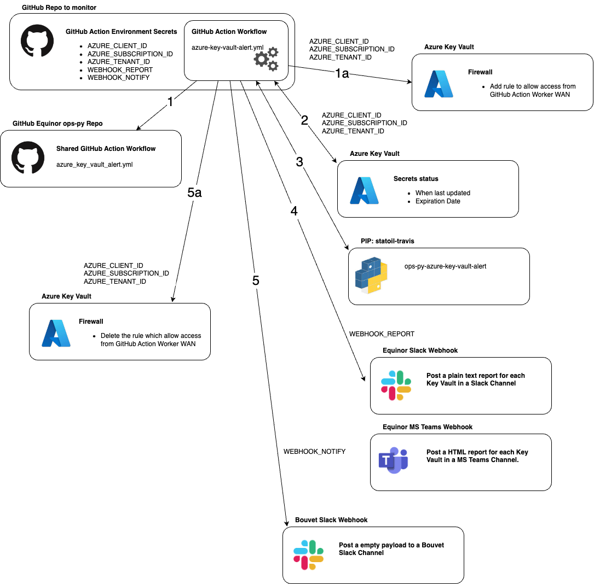
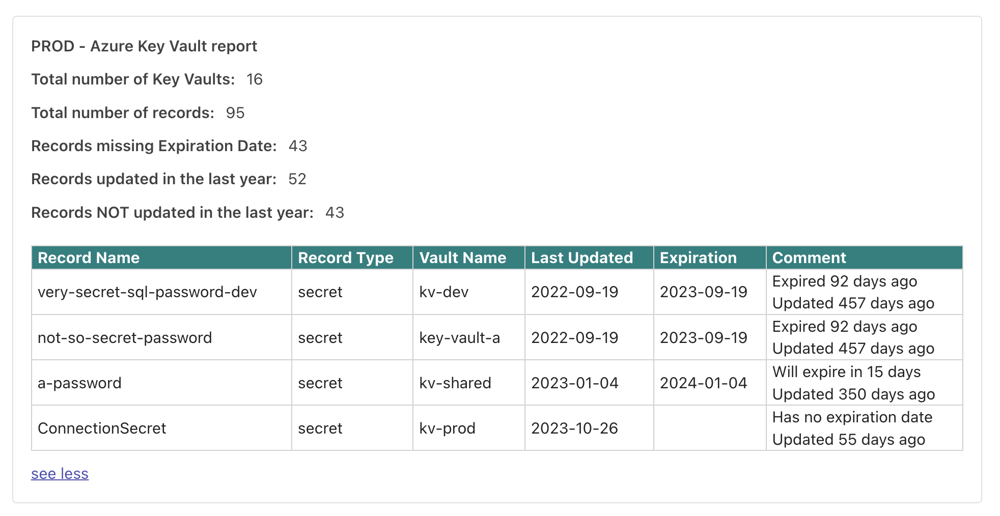

# azure-key-vault-alert

## Usage example
The example workflow below describes how to implement: 
- Scheduled runs in multiple environments
- Manual dispatch with inputs 

```
name: azure-key-vault-alert

on:
  schedule:
    - cron:  '04 07 * * 4'

  workflow_dispatch:
    inputs:
      environment:
        description: The environment to run the workflow in
        required: true
        type: choice
        options:
          - non-prod
          - prod
          
      vaults:
        description: Key Vault names (space separated)
        required: true
        type: string

      arguments:
        description: Valid arguments (space separated)
        required: false
        type: string

      handle_firewall:
        description: Open & close firewall
        required: false
        type: boolean

      list_vaults:
        description: List available key vaults to stdout
        required: false
        type: boolean

permissions:
  id-token: write
  contents: read

jobs:
  keyvault_check_dispatch:
    if: ${{ github.event_name == 'workflow_dispatch' }}
    name: manual_dispatch
    uses: equinor/ops-action/.github/workflows/azure-key-vault-alert.yml@v8.13.0
    with:
      environment: ${{ github.event.inputs.environment }}
      vaults: ${{ github.event.inputs.vaults }}
      arguments: ${{ github.event.inputs.arguments }}
      handle_firewall: ${{ github.event.inputs.handle_firewall }}
      list_vaults: ${{ github.event.inputs.list_vaults }}
    secrets:
      AZURE_CLIENT_ID: ${{ secrets.AZURE_CLIENT_ID }}
      AZURE_SUBSCRIPTION_ID: ${{ secrets.AZURE_SUBSCRIPTION_ID }}
      AZURE_TENANT_ID: ${{ secrets.AZURE_TENANT_ID }}
      WEBHOOK_REPORT: ${{ secrets.WEBHOOK_REPORT }}
      WEBHOOK_NOTIFY: ${{ secrets.WEBHOOK_NOTIFY }}

  keyvault_check_non-prod:
    if: ${{ github.event_name == 'schedule' }}
    name: schedule_non-prod
    uses: equinor/ops-action/.github/workflows/azure-key-vault-alert.yml@v8.13.0
    with:
      environment: non-prod
      vaults: kv-abc-dev kv-def-non-prod
      arguments: --teams_output --expire_threshold 35 --title "NON-PROD - Azure Key Vault report"
      handle_firewall: true
    secrets:
      AZURE_CLIENT_ID: ${{ secrets.AZURE_CLIENT_ID }}
      AZURE_SUBSCRIPTION_ID: ${{ secrets.AZURE_SUBSCRIPTION_ID }}
      AZURE_TENANT_ID: ${{ secrets.AZURE_TENANT_ID }}
      WEBHOOK_REPORT: ${{ secrets.WEBHOOK_REPORT }}
      WEBHOOK_NOTIFY: ${{ secrets.WEBHOOK_NOTIFY }}

  keyvault_check_prod:
    if: ${{ github.event_name == 'schedule' }}
    name: schedule_prod
    uses: equinor/ops-action/.github/workflows/azure-key-vault-alert.yml@v8.13.0
    with:
      environment: prod
      vaults: kv-abc-prod kv-def-prod
      arguments: --teams_output --expire_threshold 35 --title "PROD - Azure Key Vault report"
      handle_firewall: true
    secrets:
      AZURE_CLIENT_ID: ${{ secrets.AZURE_CLIENT_ID }}
      AZURE_SUBSCRIPTION_ID: ${{ secrets.AZURE_SUBSCRIPTION_ID }}
      AZURE_TENANT_ID: ${{ secrets.AZURE_TENANT_ID }}
      WEBHOOK_REPORT: ${{ secrets.WEBHOOK_REPORT }}
      WEBHOOK_NOTIFY: ${{ secrets.WEBHOOK_NOTIFY }}
```

## Inputs

| key             | type    | required | default | description                                                           |
|-----------------|---------|----------|---------|-----------------------------------------------------------------------|
| environment     | string  | True     | N/A     | The environment that the job references.                              |
| vaults          | string  | False    |         | A space separated list of key vault names to generate reports for     |
| arguments       | string  | False    |         | The list of valid arguments which `azure_key_vault_alert.py` accepts  |
| handle_firewall | boolean | False    | `false` | If set to `true` additional steps are executed to open/close firewall |
| list_vaults     | boolean | False    | `false` | If set to `true` a list of available Key Vaults are printed to STDOUT |

**Valid arguments:**   
`--expire_threshold`     
If this argument is provided and followed by a int value (int), 
the record will only be reported if days to the record's Expiration Date is below the threshold.

`--include_no_expiration`   
If this argument is provided, the report will also include the records which has no Expiration Date set.

`--include_all`  
If this argument is provided, the report will include all the records (verbose).

`--teams_output`  
If this argument is provided, a MS Teams json object (containing a html table) of the report will be generated and used as the payload.

`--report_if_no_html`  
If this argument is provided, a summary / facts report will be posted even though no table of records is produced (no records meets the criteria in order to be reported).

`--record_types`  
The different types of Key Vault objects to check for. Provided as a space separated list. The valid types are `certificate` `secret` `key`. If not provided then all the valid types are used.

`--title`  
The title the message will be posted with in Slack or MS Teams.

`--slack_max_chars`  
The max characters the report can have due to the Slack Workflow message limits (Default: 13081)

`--teams_max_chars`  
The max characters the report can have due to the MS Teams payload size limits (Default: 22854)

`--stdout_only`  
Only print report to stdout. No post to messagehandler (Slack or MS Teams")

For examples, please refer to the above usage examples code blocks.

## Secrets

| key                   | required | description                                                                         |
|-----------------------|----------|-------------------------------------------------------------------------------------|
| AZURE_CLIENT_ID       | True     | The client ID of the Azure AD service principal to use for authenticating to Azure. |
| AZURE_SUBSCRIPTION_ID | True     | The ID of the Azure subscription to create the resources in.                        |
| AZURE_TENANT_ID       | True     | The ID of the Azure tenant to create the resources in.                              |
| WEBHOOK_REPORT        | False    | The webhook to where the report(s) willl be posted.                                 |
| WEBHOOK_NOTIFY        | False    | The webhook to where a empty post will be posted when all done.                     |

## Diagram and description

Create a Github Action Workflow in the desired Github repo like described in the [usage example](#usage-example).  

1. The Workflow will use the shared [azure-key-vault-alert.yml](..%2F..%2F.github%2Fworkflows%2Fazure-key-vault-alert.yml) workflow.    
   a. **NOTE:** If input `handle_firewall` is set to `true`, an additional step is run in order to add a `keyvault network-rule`, which enables access from the GitHub Action Worker WAN IP.  
   This firewall rule is `always` deleted at the end of workflow run (referred to as `step 5a` in the [diagram below](#diagram).)
2. Using the _Federated credentials_ for the **App registrations**, the workflow fetches the **Key Vault Secrets** from the specified **Key Vault**.  
   **NOTE:** The credentials are stored in the following **GitHub Action Secrets**:
    - `AZURE_CLIENT_ID`
    - `AZURE_SUBSCRIPTION_ID`
    - `AZURE_TENANT_ID`
3. The workflow then downloads the Python PIP package [ops-py-azure-key-vault-alert](https://pypi.org/project/ops-py-azure-key-vault-alert/) from the [Statoil Travis PyPI account](https://pypi.org/user/statoil-travis/)
4. Using the **ops-py-azure-key-vault-alert** package, the reports are continually generated and posted to the specified webhook url   
   **NOTE:** The webhook url is stored as a **GitHub Action Secret** named: `WEBHOOK_REPORT`
5. When all the reports have been posted, an optional `POST may be posted to an additional webhook url (e.g. to another Slack Workspace). This webhook url is stored as a **GitHub Action Secret** named: `WEBHOOK_NOTIFY`

**NOTE:** If input `handle_firewall` is set to `true`, the rule created in step `1a` is `always` deleted. This step is referred to as `step 5a` in the diagram below.


### Azure Key Vault Alert & Azure Key Vault Report
Various arguments are supported, e.g.:
- to output a list of all secrets.
- to output only secrets that have and/or will soon expire
- to report on specific or multiple record types, `certificate secret key`

Please refer to the following documentations:
- [azure-key-vault-alert](https://github.com/equinor/ops-py/tree/main/packages/azure-key-vault-alert/src)
- [azure-key-vault-report](https://github.com/equinor/ops-py/blob/main/packages/azure-key-vault-report/src/readme.md)


### Diagram
The following diagram illustrates the steps involved in the called workflow:     


## Output examples:
Plain text to Slack:
```
------------------------------------------------------------------------------------------------------------------------------------------------------------------------------------
 Record Name                                  | Record Type    | Vault Name                         | Last Updated   | Expiration     | Comment                                                
------------------------------------------------------------------------------------------------------------------------------------------------------------------------------------
 cert-test-dv                                 | certificate    | key-vault-a                        | 2023-12-18     | 2024-02-18     | Will expire in 60 days. Updated 2 days ago. 
 secret-a                                     | secret         | key-vault-a                        | 2023-10-13     | 2025-08-11     | Will expire in 600 days. Updated 68 days ago. 
 private-key                                  | key            | private-key-vault-b                | 2023-12-18     | 2025-12-18     | Will expire in 729 days. Updated 2 days ago. 
------------------------------------------------------------------------------------------------------------------------------------------------------------------------------------
 Records updated in the last year.........: 5
 Records missing Expiration Date..........: 2
 Total number of records..................: 5
 Total number of vaults...................: 2
------------------------------------------------------------------------------------------------------------------------------------------------------------------------------------
```
MS Teams with HTML table:


## Further reading
- [GitHub Action Reusable Workflows documentation](https://docs.github.com/en/actions/using-workflows/reusing-workflows)
